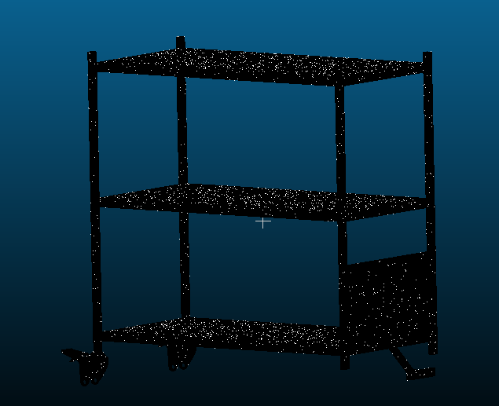
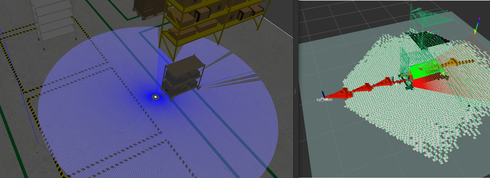

### AMR对接位姿估计

> 对接载具人为计算提取特征的方式在AMR行业过繁琐，不能适用大部份载具，此功能包用icp的方式匹配以概率的形式进行迭代估计载具的位姿


#### 运行：

**编译：**

```
colcon build --symlink-install --packages-select docking_pose_estimator、
source install/setup.zsh
```

**仿真环境：**

1.运行turtlebot3仿真环境

```
export TURTLEBOT3_MODEL=waffle
ros2 launch turtlebot3_gazebo turtlebot3_amr_world.launch.py
```

2.位姿估计节点

```
ros2 launch docking_pose_estimator docking_pose_launch.py
```

**真机环境：**


#### 问题：

- 模版全局不够问题
- 地面的影响


#### TODO LIST：

- [x] 载具对接功能包构建
- [ ] 全景载具的模版制作和icp匹配效果
- [ ] 自动特征提取
- [ ] 标准对接动作方案
- [ ] 载具倾斜问题


#### 模版制作：

**1.建模软件导出stl格式，再用cloudcompare转换为pcd或者ply**



**2.用rtabmap建图，再用cloudcompare来裁剪**



**3.用高精度的三维扫描设备扫描**


#### **参考：**

[**基于ICP点云配准的工件位姿估计-Open3D**](https://www.bilibili.com/video/BV1wr4y1S7UB/?spm_id_from=333.337.search-card.all.click&vd_source=7f98e46af73470a39ad6b1a64611b176)
